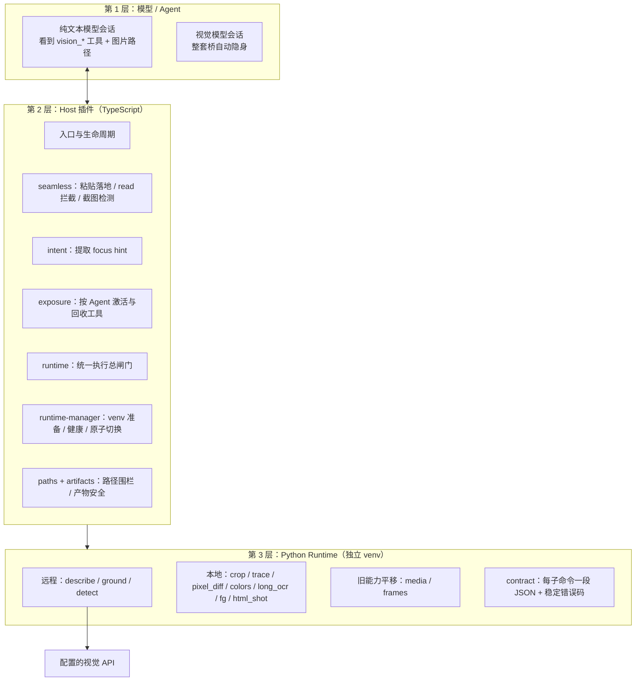
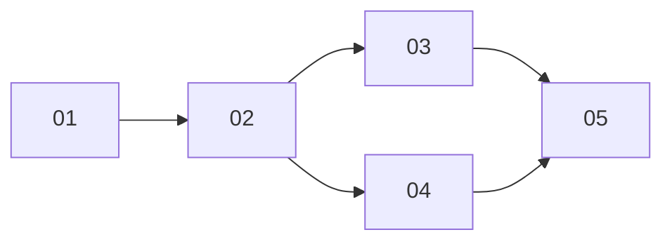

# vision-bridge Route C — 共享上下文（任何独立会话开工前先读本文件）

## 0. 仓库与语言

- 仓库根目录：`dp_harness_enhance`（dsh 插件多项目仓库，各项目独立）。
- 工作语言：中文（遵循仓库 AGENTS.md）。
- 本特性只动 `vision-bridge/`（以及本 `.scratch/` 目录），不修改其他插件项目。
- 参考项目 `agent-vision-toolkit/` 在仓库内（含子包 `dsh-vision-toolkit/`），**只读借鉴其逻辑**，Route C 是自研实现，不引入它的代码依赖、不拷贝它的源码。

## 1. 业务目标

给纯文本模型的 dsh Agent 装上完整的视觉工程能力：

- 用户粘贴截图 / Agent 读图 / bash 产出截图：无缝桥接（vision-bridge 独有）。
- 需要看图时，Agent 调用结构化原生工具，而不是拼 shell 命令。
- 语义问题交给远程视觉模型；像素级事实（坐标、颜色、差异、几何）交给本地确定性工具。
- 视觉模型会话整套能力自动隐身，不干扰原生图片输入。

## 2. 旧实现现状（开工前的事实）

旧版 vision-bridge 由三部分组成：一个 Cordis 插件（单文件 JS）、一个 `dsh-vision` Python CLI、一个把 CLI 同步进插件内嵌副本的脚本。它已有能力：粘贴图片落地转路径、read/read_image 读图拦截、bash 出图检测与自动描述、按模型能力隐身。

**两个 bug 已经提交在 HEAD，旧版当前是坏的：**

1. 同步脚本用字符串替换模式生成内嵌副本，CLI 源码里的 `$'` 被解释成替换符，导致生成物把插件 JS 代码体吞进 CLI 字符串中间，内嵌 Python 语法错误。
2. 插件定位项目内 CLI 的相对层级多了一级，运行时永远读不到真源，启动时把（损坏的）内嵌副本装到用户 bin 目录。

Route C 最终会删除旧实现，因此 01 票只做最小修复作为过渡，不做旧版其他改造。

## 3. 目标架构（Route C 冻结版，无客户端 UI）

三层职责：模型层只按 schema 调工具；Host 层管资格、安全、并发、凭据、生命周期；Python 层只负责“发图给 VLM”或“本地确定性计算”。

### 模块职责（按名理解，不纠结具体文件）

- **入口与生命周期**：装配时校验配置；runtime 没就绪就不发布任何模型能力；卸载先取消活动操作再回收注册。
- **seamless**：三条钩子（粘贴落地、读图拦截、bash 出图检测），状态按会话隔离。
- **intent**：从会话事件提取“为什么看这张图”，截尾 500 字符，无意图时不许借用旧上下文。
- **exposure**：每个 Agent 独立状态机；激活后把工具注册到该 Agent 并隐藏引导工具；Agent 结束即回收。
- **runtime**：所有工具共用的执行管道——输入校验、并发信号量、超时/取消、凭据解析、subprocess argv 调用、JSON 契约校验、产物提交、指标日志。
- **runtime-manager**：managed 模式按锁定依赖准备隔离 Python 环境；配置变更先准备候选、成功才原子切换。
- **paths / artifacts**：输入 realpath 围栏（工作区 + allowedDirs）；输出写工作区产物目录，staging 校验后原子提交。
- **Python runtime**：单入口分派子命令；每个子命令无状态、argv 输入、stdout 输出一段 JSON；错误用稳定退出码 + 脱敏 stderr。

## 4. 冻结的架构决策（所有票必须遵守）

| # | 决策 |
|---|---|
| D1 | 视觉是 harness 能力：工具挂在宿主上，不依赖模型原生多模态 |
| D2 | 语义与像素分家：模型描述/OCR 不是像素级证据；坐标、颜色、差异、几何用本地工具确定 |
| D3 | 每次看图带意图：能提取 focus hint 就必须传；hint 只用于判断重点，与图无关则忽略 |
| D4 | 双轨：粘贴/读图走 seamless（无感）；复杂任务走显式原生工具；两条轨共享同一个 runtime |
| D5 | 渐进暴露：未激活 Agent 的上下文里一个执行工具都没有；激活只影响当前 Agent |
| D6 | Host↔Python 契约：argv 向量 + 环境变量 + stdout 单段 JSON + 稳定错误码；禁用 shell 拼接 |
| D7 | 凭据只存 DSH Credential 引用，每次远程操作现取现用、只注入子进程环境，绝不落盘 |
| D8 | 无客户端 UI：配置写在 bundle 装配行；健康状态走日志；产物就是工作区文件 |
| D9 | 产物目录：工作区内固定子目录；模型可见结果是结构化描述，可继续喂给其他工具 |
| D10 | managed 运行时：按锁定依赖建隔离 venv；不自研视觉算法，Python 层直接实现需要的图像逻辑 |
| D11 | 仅本地交付：本地安装到 profile；不创建 GitHub issue/release、不发布任何制品（本组票本身是本地 markdown） |
| D12 | 无全局状态：能力判断、桥接开关、缓存都按会话/Agent 隔离；失败缓存必须带过期时间 |

## 5. 工具清单（12 个执行工具 + 1 个引导工具）

| 工具 | 执行 | 输入→输出要点 | 归属票 |
|---|---|---|---|
| vision_media | 本地 ffprobe | 文件 → 时长/分辨率/流/编码 JSON | 01 |
| vision_frames | 本地 ffmpeg | 视频 + 时间点 → 帧文件路径列表 | 01 |
| vision_glance | 远程 VLM | 图 + 问题/OCR → 回答 | 02 |
| vision_ground | 远程 VLM | 图 + 目标名 → 原图像素框 | 02 |
| vision_detect | 远程 VLM | 图 + 类别 → 编号元素清单 + 逐字文字 | 02 |
| vision_crop | 本地 | 像素框 → 裁剪文件 | 02 |
| vision_pixel_diff | 本地 | 两图 → 差异比例 + 最差区域 + 热力图/报告 | 02 |
| vision_dominant_colors | 本地 | 区域 → 主色分布 / 候选色打分 | 02 |
| vision_trace | 本地 | 扁平图形 → SVG 几何 | 04 |
| vision_extract_foreground | 本地 | 图标/logo → 透明 PNG | 04 |
| vision_long_screenshot_ocr | 本地切分 + 远程 OCR | 长截图 → 合并 Markdown + 边界审计 | 04 |
| vision_html_screenshot | 本地浏览器 | HTML → 视口 PNG | 04 |
| vision_activate | 引导 | 激活当前 Agent，激活后自动隐藏 | 01 |

## 6. 票据与依赖

| # | 标题 | Blocked by |
|---|---|---|
| 01 | 修复旧版两个 bug + 新架构基座（media/frames 首条切片） | 无 |
| 02 | 核心工具主干道：远程三件套 + 本地三件套 + 产物管线 | 01 |
| 03 | Seamless 桥 + 意图提取 + 自动激活 | 02 |
| 04 | 剩余视觉工具 | 02 |
| 05 | 生产化收口 + 全量 e2e + 本地切换（不发布） | 03、04 |

## 7. 术语表

- **seamless 桥**：不改变用户习惯的自动桥接（粘贴、read、截图检测），区别于显式工具调用。
- **focus hint / 意图**：模型/用户“为什么看这张图”的文本，传给 VLM 让它突出重点。
- **渐进暴露 / exposure**：工具 schema 按 Agent 激活后注册，不常驻所有会话。
- **generation**：一个已就绪的运行时实例；配置切换=准备新 generation→原子替换，失败保留旧的。
- **契约 JSON**：Python 子命令 stdout 的唯一格式，Host 校验通过才回给模型。
- **artifact / 产物**：工具生成的工作区文件及其结构化描述（路径/大小/类型/来源工具）。

## 8. 每票开工约定

- 先读本文件 + 对应票文件内的「会话上下文」小节，再读仓库里涉及的现有代码。
- 票内验收清单是出口标准，逐项打勾才算完成；没有写验收的行为不要扩做。
- 每票结束必须留下可运行的验证证据（命令 + 结果摘要）写进该票的完成记录或提交信息。
- 除 01 票要动旧实现做修复外，其余票只新增/替换 Route C 代码；05 票之前旧实现保持可用。
